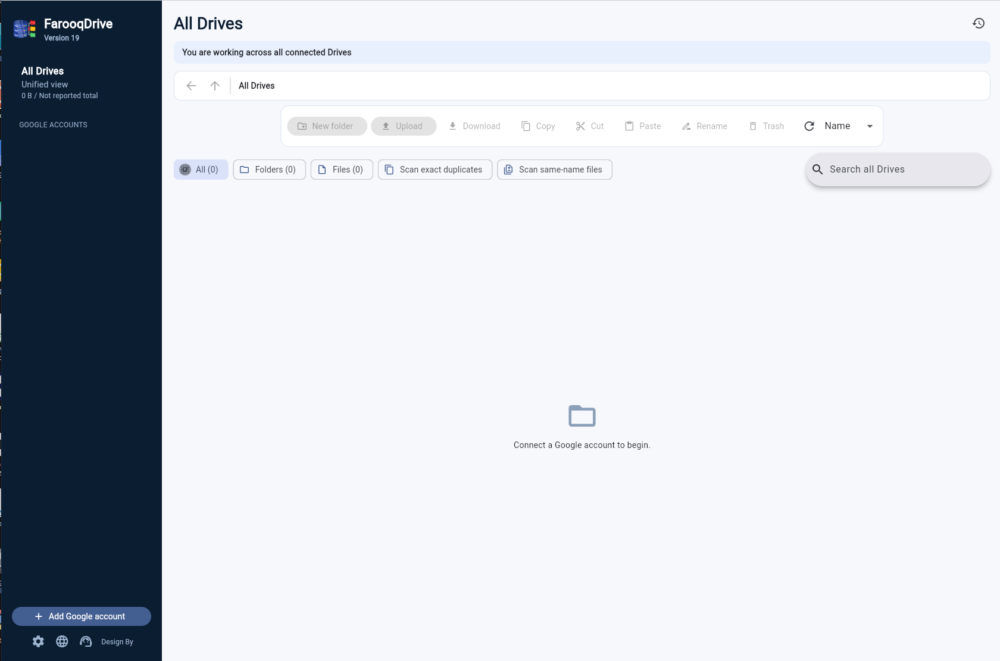
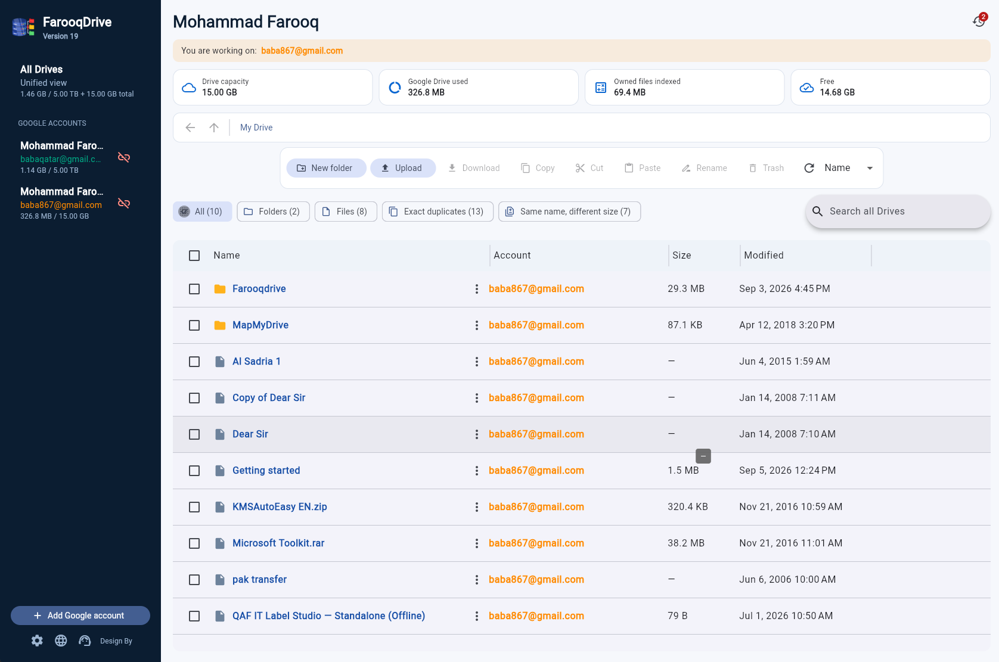

# FarooqDrive Complete Edition

## Live Web App

[Open FarooqDrive in your browser](https://farooqmusicai.github.io/FarooqDrive/)

This public GitHub Pages edition is provided for testing the Web application.

## Demo Video

[Watch the FarooqDrive Windows and Web demonstration on YouTube](https://www.youtube.com/watch?v=JrCJkNApJtU)

The video demonstrates FarooqDrive Version 19, Google account connection, the
unified Drive interface, storage information, and file-management workflow.

## Screenshots

### All Drives — ready to connect

### Connected accounts and file management

FarooqDrive presents multiple Google Drive accounts in one file-manager
interface. This repository contains:

- `apps/flutter`: cross-platform edition; Web is the first reference platform.
- `apps/desktop`: standalone Windows 11 desktop edition (Windows 10 best effort).
- `dist`: install-free web edition.
- `docs`: Google OAuth, usage, build, publishing, privacy, and troubleshooting.

## Non-negotiable credential rule

This repository contains **no developer or user credential**. Every person who
builds or deploys FarooqDrive creates their own Google Cloud project and OAuth
client. Never commit a Client Secret, access token, refresh token, OAuth JSON,
database, or signing certificate.

## Start here

1. Read [Google OAuth setup](docs/GOOGLE-OAUTH-SETUP.md).
2. Windows users read the [English guide](docs/WINDOWS-GUIDE.md) or
   [Urdu guide](docs/WINDOWS-GUIDE-URDU.md).
3. Web deployers read [Web guide](docs/WEB-GUIDE.md).
4. Read User Help in [English](docs/USER-HELP.md) or
   [Urdu](docs/USER-HELP-URDU.md), plus [Troubleshooting](docs/TROUBLESHOOTING.md).
5. Review Privacy in [English](docs/PRIVACY.md) or
   [Urdu](docs/PRIVACY-URDU.md), and Terms in [English](docs/TERMS.md) or
   [Urdu](docs/TERMS-URDU.md).

## Editions

| Capability | Windows | Web |
| --- | --- | --- |
| Multiple Google accounts | Yes | Yes, current browser session |
| Browse Drive folders | Yes | Yes |
| Upload/download/create folder | Yes | Yes |
| Rename, move, copy, trash | Yes | Yes |
| Search, sort, multi-select | Yes | Yes |
| Unified storage totals | Yes | Yes |
| Local secrets | Encrypted on the PC | No secret is used |
| Server storage | None | None |

## Status

Version 20 is a release candidate until the responsive Windows update is tested
and Google OAuth is verified with the
owner's production domains and the Windows installer is tested on clean Windows
11 and Windows 10 machines.

Cross-account copy intentionally uses a download-then-upload workflow in this
release; direct streamed transfer remains on the production checklist. See
[release status](docs/RELEASE-STATUS.md).
