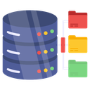

<p align="center"></p>

# FarooqDrive

**Official branding:** the database-and-folders artwork in `assets/branding/` is the approved FarooqDrive icon for the Windows app, installer, Microsoft Store, Google OAuth branding, GitHub and release documentation.

FarooqDrive is a Windows desktop application that lets a user connect multiple authorized Google Drive accounts and use them through one storage dashboard.

## Main features
- Email/password local profile or Google sign-in.
- Connect multiple Google Drive accounts.
- Combined total, used and free storage dashboard.
- Automatic selection of an account with enough free quota for an upload.
- A `Farooqdrive` folder in each connected Google Drive.
- Direct Google Drive resumable uploads with progress UI.
- Virtual folders stored locally, allowing one virtual folder to contain files from different Google accounts.
- Manual Drive-to-local metadata sync.
- Preview, download, rename, virtual move and trash.
- Encrypted OAuth refresh-token storage.
- Embedded SQLite database; no MySQL, Docker or separate database installation is required for end users.

## End-user installation
Public release users should install **FarooqDrive Setup.exe** or obtain FarooqDrive from the Microsoft Store. End users do not need Node.js, Docker, MySQL or a command line.

## Developer build
Developer builds require Node.js and npm. Google OAuth credentials are **not required at build time**. After the app starts, use the same first-run setup wizard as an end user.

```text
npm install
npm run build
npm start
```

To build Windows installers on Windows:

```text
npm run dist:win
```

## Google OAuth
FarooqDrive uses the OAuth 2.0 installed/desktop application flow with a loopback redirect and requests `openid`, `email`, `profile` and `https://www.googleapis.com/auth/drive.file`.

## Public repository safety
Never commit personal OAuth credentials, signing certificates, private keys, access tokens, refresh tokens or Microsoft Partner Center secrets.

## License
MIT License. See `LICENSE`.

## Privacy and security
See `PRIVACY.md` and `SECURITY.md`.


## Windows build without local developer tools
See `docs/BUILD_WINDOWS_WITH_GITHUB_URDU.md`. The GitHub workflow builds the Setup and Portable EXE on a Windows runner. Google OAuth Repository Secrets are not needed.

## Bring Your Own Google OAuth credentials

FarooqDrive's public Windows build intentionally contains **no publisher Google Client ID or Client Secret**. On first launch, an in-app setup wizard guides the user through creating a Google Cloud project, enabling Google Drive API, creating a Desktop OAuth client, and entering their own credentials. Those credentials are encrypted locally on that PC.

This design keeps the GitHub repository and standard Windows binaries free of personal/API secrets and prevents all users from depending on one publisher OAuth quota/project.

